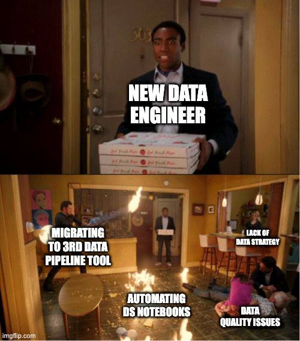

# 💻 Journal - 2026-08-29 - Day 6: From Data Modeling to Data Engineering

## Today in one sentence
- Today was the day I started seeing data engineering as more than just writing SQL — it is about building something that other people can understand, trust, reuse, and work on together.

## What I learned
- Today we went deeper into **dimensional modeling** using the Chinook dataset. Last week was more about building the model, but today was about understanding *why* we designed it that way.
- I understood the difference between facts and dimensions better. Facts tell us what happened and what we can measure, while dimensions give the event its context — like customer, track, artist, genre, or date.
- I liked the "BY" test because it makes identifying dimensions much easier. If the question is "Revenue BY Genre" or "Sales BY Month," the words after "BY" usually tell us the context we want to analyze.
- Something I found interesting was that dimensional modeling can intentionally repeat information. At first, it felt wrong because I had just learned about normalization. But I realized that OLTP and OLAP have different purposes. Sometimes we accept some duplication in an analytical model because it makes business questions much easier and faster to answer.
- Another big lesson for me was that a data pipeline isn't really finished just because the SQL works. It also needs **validation, version control, documentation, and collaboration**. It's fun learning GitHub!
- I also learned that documentation is part of engineering, not just an extra thing we do at the end. A good project should explain what it is, why it exists, how it works, how to run it, and how we know it is correct. 

## Terms I am still learning
- **OLTP** - systems focused on running the business and handling frequent transactions.
- **OLAP** - systems focused more on analyzing data and understanding the business.
- **Version control** - a way of keeping track of changes to code so we know what changed, why it changed, and who changed it.
- **Commit** - a meaningful checkpoint in the history of a project.

## What confused me
- I was initially confused about why we would purposely repeat information in a dimensional model after learning how important normalization is. I think I understand it better now: **the model should match how the data will be used**. A normalized model is useful for operational systems, while a dimensional model can make analysis much simpler.
- I also realized that creating a star schema isn't just about drawing tables around a fact table. We have to start with the business process, define the grain, decide on the facts, and then identify the dimensions we need.
- I still want to get more comfortable with Git and GitHub, especially the whole pull → change → validate → commit → push workflow. I understand the idea, but I know I need more practice before it feels natural.

## One small next step
- [x] Practice the Git workflow by making a small change, validating it, committing it with a meaningful message, and pushing it to GitHub.
- [x] Review the Instacart pipeline and make sure I can clearly explain the grain, facts, dimensions, keys, and relationships.

## Git checkpoint
- [x] I created or updated a file
- [x] I wrote a commit
- [x] I pushed my changes

## Decisions or assumptions
- I want to be more intentional about defining the grain before creating a fact table. It seems like a small decision, but it affects everything that comes after it.
- I also want my project documentation to be useful enough that another engineer could take over without needing to ask me a million questions. 

## Evidence from today
- Day 6 lecture: Dimensional Modeling, Git/GitHub, documentation, and engineering workflow.
- Today's homework is to engineer Instacart through:
  `INSTACART → BRONZE → SILVER → GOLD → DASHBOARD`
- The project should demonstrate the pipeline, dimensional model, validation, Git, and documentation.

## Reflection

### What felt easy today?
- I think the business-question side of dimensional modeling is becoming easier for me. Once I think about what the business wants to know, it becomes easier to think about the measure and the context around it.
- I also enjoyed seeing how everything connects. It isn't just SQL → result. It's data → model → validation → Git → documentation → something the business can actually use.

### What felt difficult today?
- The biggest challenge for me was changing my mindset from simply "making the query work" to thinking like an engineer.
- I am used to thinking about whether I can get the correct output, but today made me realize that the bigger question is whether someone else can understand what I built, trust the result, and continue working on it.
- GitHub is also something I am still getting used to, so I know I need more hands-on practice.

### What do I want to understand better next time?
- I want to become more confident with designing fact and dimension tables from scratch.
- I also want to understand Git/GitHub better so that collaborating with other engineers doesn't feel intimidating.
- Most importantly, I want to get better at explaining why I made a particular modeling decision instead of only explaining what I did.

## Mood or meme 💗

